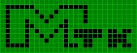
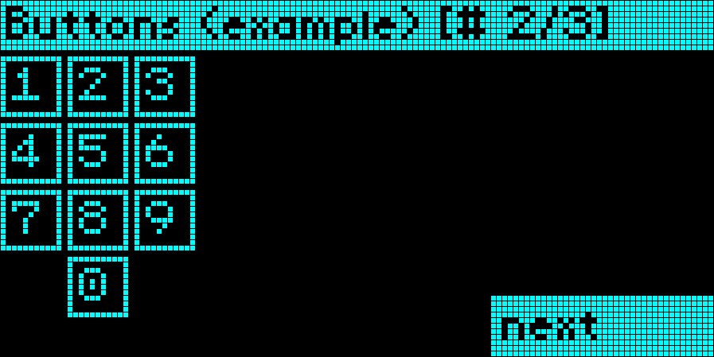

# MTK - Monochrome Tool Kit

Status: not complete yet.

Simple high-level toolkit to rapidly create user interfaces on monochrome
displays written in C++.

# imutil

A simple tool to generate images that can be used in your application.

# Mock LCD

Helps to develop the code without real hardware. May be used as reference
to implementation of display drivers. Written in C++ using FLTK framework.
